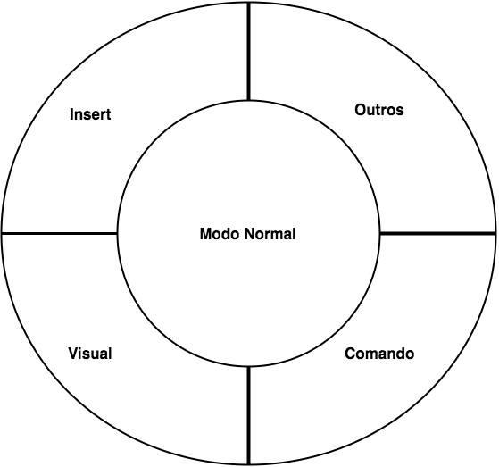

# VIM

Editor de texto em modo texto, contem diversas funcionalidades para melhorar o dia a dia do Sysadmin nas configurações dos serviços.

### Modo Inserção

`O` - Modo insert linha acima.

`o` - Modo insert linha abaixo.

`I` - Modo insert começo da linha.

`i` - Modo insert no cursor.

`A` - Modo insert no final da linha.

`a` - Modo insert após o cursor.

 

### Modo Normal

`ZZ`          - Salva e sai do arquivo.

`zz`          - Acrescenta linhas vazias no final do arquivo.

`w`           - Vai para próxima palavra no inicio.

`e`           - Vai para próxima palavra no final.

 

### Modo comando

`:w`          - Salva arquivo.

`:q`          - Sai do arquivo.

`:w!`         - Salva forçado.

`:q!`         - Sai forçado.

`:wq`         - Sai e Salva.

`:x`          - Sai e salva.

Execução:

`:!ls /`      - Lista o conteudo do raiz.

`:r ls /[diretorio]`     - Lista o conteudo do diretorio jogando no arquivo aberto.

Substituição:

`:s/bash/sh`  - Substitua bash por sh na linha.

`:%s/bash/sh` - Substitua bash por sh no arquivo inteiro.

 

### Modo Visual

`v`               - Entra no modo visual.

`ctrl+v`          - modo visual block.

`shift+v`         - modo visual.

### Exemplo para apresentação

Segue exemplo para demostração do VIM:

